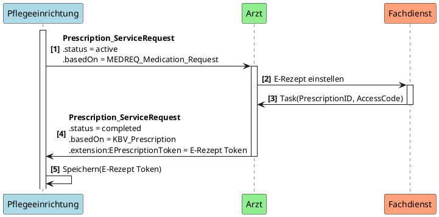
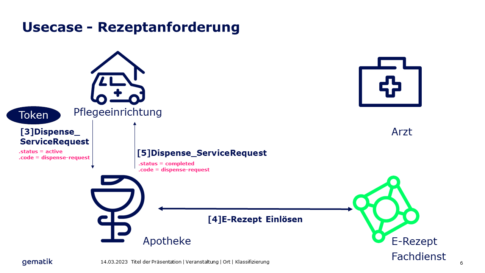
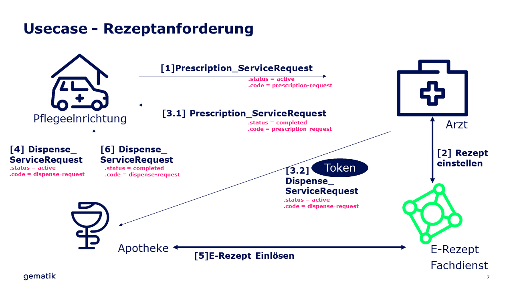

# Anwendungsfall Rezeptanforderung (UC1, UC2, UC3)
Diese Seite beschreibt kurz die fachliche Beschreibung einer "Rezeptanforderung". Für eine detaillierte Beschreibung dient das FeatureDokument "KIM-Nachrichten für das E-Rezept" (gemF_eRp_KIM) //TODO: Link.

Anschließend werden die zu verwendenden Ressourcen angegeben. 

Beispiele für diesen Anwendungsfall befinden sich im [Simplifier Projekt](https://simplifier.net/erezept-medicationrequest-communication/~resources?category=Example&exampletype=Bundle&sortBy=RankScore_desc). Beispiele für diesen Anwendungsfall sind benannt nach "UC1-...", "UC2-...", "UC3-..."

## Fachliche Kurzbeschreibung UC1

### Anfragen einer Verordnung durch einen Arzt
Eine Pflegeeinrichtung benötigt eine Verordnung für ein Medikament. Diese fragt nun einen Arzt um eine entsprechende Verordnung an ([1]). Der Arzt kann, in dem Fall, dass er zustimmt, diese Verordnung nun erstellen, signieren und im E-Rezept Fachdienst einsetellen ([2]). Der Arzt erhält in der Antwort vom Fachdienst die PrescriptionID und den Access Code. Beide Informationen werden benötigt, um eine Verordnung in einer Apotheke einzulösen. 

Der Arzt übermittelt diese Informationen in Form des E-Rezept-Tokens (siehe [gemSpec_DM_eRp](https://fachportal.gematik.de/dokumentensuche?tx_gemcharacteristics_productlist%5BformIdentifier%5D=form-2849&tx_gemcharacteristics_productlist%5Btype%5D=ProdT&tx_gemcharacteristics_productlist%5Bproducttype%5D=107&tx_gemcharacteristics_productlist%5Bproducttypeversion%5D=75#c2849)) an die Pflegeeinrichtung ([3]).

### Anfragen einer Abgabe durch eine Apotheke

Die Pflegeeinrichtung ist nun im Besitz der Informationen, um ein Rezept in einer beliebigen Apotheke einzulösen. Über eine Anfrage der Apotheke zur Dispensierung eines Medikamentes ([4]), kann die Pflegeeinrichtung nun mit den verordneten Medikamenten beliefert werden.
Die Apotheke kann nun im letzten Schritt die Verarbeitung der Anfrage und die Belieferung bestätigen ([5]).

## Fachliche Kurzbeschreibung UC2

In diesem Anwendungsfall soll der Verordnende den Dispense_ServiceRequest an die Apotheke weiterleiten, ohne dass die Pflegeeinrichtung das selbst tun muss.
Das PVS generiert dabei den Dispense_ServiceRequest und stellt diesen mit den nötigen Informationen an die Apotheke aus. Die Apotheke informiert die Pflegeeinrichtung über der Erhalt der Anfrage und benachrichtig die Pflegeeinrichtung wenn die Dispensierung erfolgt ist.

## Fachliche Kurzbeschreibung UC3

In diesen Anwendungsfall fragt die Pflegeeinrichtung einen Arzt an eine Verordnung auszustellen. Der Patient geht dann selbst in die Apotheke und löst das E-Rezept via E-Rezept App oder eGK in der Apotheke ein.

## Beschreibung der FHIR-Ressourcen

