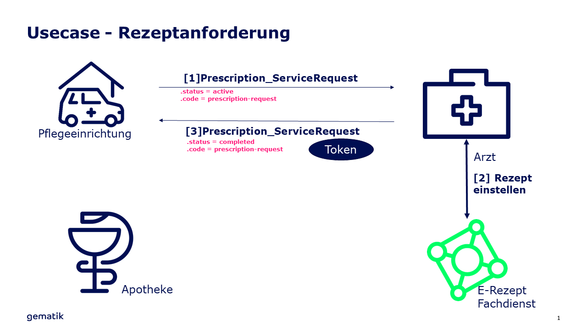

# Anwendungsfall Rezeptanforderung
Diese Seite beschreibt kurz die fachliche Beschreibung einer "Rezeptanforderung". Für eine detaillierte Beschreibung dient das FeatureDokument "KIM-Nachrichten für das E-Rezept" (gemF_eRp_KIM) //TODO: Link.

## Anfragen einer Verordnung durch einen Arzt
Eine Pflegeeinrichtung benötigt eine Verordnung für ein Medikament. Diese fragt nun einen Arzt um eine entsprechende Verordnung an ([1]). Der Arzt kann, in dem Fall, dass er zustimmt, diese Verordnung nun erstellen, signieren und im E-Rezept Fachdienst einsetellen ([2]). Der Arzt erhält in der Antwort vom Fachdienst die PrescriptionID und den Access Code. Beide Informationen werden benötigt, um eine Verordnung in einer Apotheke einzulösen. 

Der Arzt übermittelt diese Informationen in Form des E-Rezept-Tokens (siehe [gemSpec_DM_eRp](https://fachportal.gematik.de/dokumentensuche?tx_gemcharacteristics_productlist%5BformIdentifier%5D=form-2849&tx_gemcharacteristics_productlist%5Btype%5D=ProdT&tx_gemcharacteristics_productlist%5Bproducttype%5D=107&tx_gemcharacteristics_productlist%5Bproducttypeversion%5D=75#c2849)) an die Pflegeeinrichtung ([3]).

## Anfragen einer Abgabe durch eine Apotheke

Die Pflegeeinrichtung ist nun im Besitz der Informationen, um ein Rezept in einer beliebigen Apotheke einzulösen. Über eine Anfrage der Apotheke zur Dispensierung eines Medikamentes ([4]), kann die Pflegeeinrichtung nun mit den verordneten Medikamenten beliefert werden.
Die Apotheke kann nun im letzten Schritt die Verarbeitung der Anfrage und die Belieferung bestätigen ([5]).

