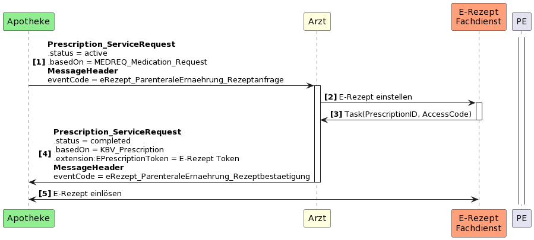

# Anwendungsfall Parenterale Zubereitung (UC4)
Diese Seite beschreibt kurz die fachliche Beschreibung einer "Parenterale Zubereitung". Für eine detaillierte Beschreibung dient das FeatureDokument "KIM-Nachrichten für das E-Rezept" (gemF_eRp_KIM) //TODO: Link.

Anschließend werden die zu verwendenden Ressourcen angegeben. 

Beispiele für diesen Anwendungsfall befinden sich im [Simplifier Projekt](https://simplifier.net/erezept-medicationrequest-communication/~resources?category=Example&exampletype=Bundle&sortBy=RankScore_desc). Beispiele für diesen Anwendungsfall sind benannt nach "UC4-..."

## Fachliche Kurzbeschreibung UC4

In diesem Sonderfall initiiert eine Apotheke nach dem Start der Zubereitung einer parenteralen Zubereitung die Rezeptanforderung (**[1]**).

Hierbei muss die Verordnung exakt der angefragten Medikation entsprechen. Diese Art der Anfrage wird über `MessageHeader.eventCode = eRezept_ParenteraleErnaehrung_Rezeptanfrage` kenntlich.

Der Arzt übernimmt die angefragte Medikation in die Verordnung und stellt diese im E-Rezept Fachdienst ein (**[2]**). Darauf hin erhält der Arzt die Informationen für den E-Rezept Token (**[3]**) und übermittelt den Token an die Apotheke (**[4]**).

Diese kann nun das Rezept am E-Rezept Fachdienst einlösen (**[5]**).

## Beschreibung der FHIR Ressourcen

### ID's