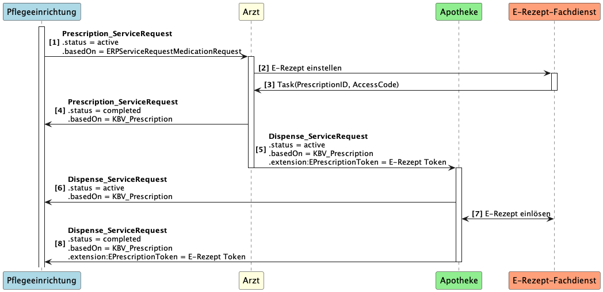

## {{page-title}}
Diese Seite beschreibt kurz die fachliche Beschreibung einer "Rezeptanforderung". Für eine detaillierte Beschreibung dient das FeatureDokument "KIM-Nachrichten für das E-Rezept" (gemF_eRp_KIM) //TODO: Link.

Anschließend werden die zu verwendenden Ressourcen angegeben. 

Beispiele für diesen Anwendungsfall befinden sich im [Simplifier Projekt](https://simplifier.net/erezept-medicationrequest-communication/~resources?category=Example&exampletype=Bundle&sortBy=RankScore_desc). Beispiele für diesen Anwendungsfall sind benannt nach "UC1-...", "UC2-...", "UC3-..."

## Fachliche Kurzbeschreibung UC2

In diesem Anwendungsfall soll der Verordnende den Dispense_ServiceRequest an die Apotheke weiterleiten, ohne dass die Pflegeeinrichtung das selbst tun muss.
Das PVS generiert dabei den Dispense_ServiceRequest und stellt diesen mit den nötigen Informationen an die Apotheke aus. Die Apotheke informiert die Pflegeeinrichtung über der Erhalt der Anfrage und benachrichtig die Pflegeeinrichtung wenn die Dispensierung erfolgt ist.

