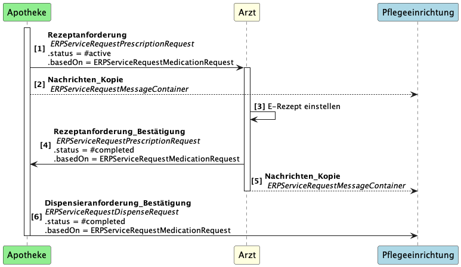

## {{page-title}}
Diese Seite beschreibt kurz die fachliche Beschreibung einer "Rezeptanforderung". Für eine detaillierte Beschreibung dient das FeatureDokument "KIM-Nachrichten für das E-Rezept" (gemF_eRp_KIM) //TODO: Link.

Anschließend werden die zu verwendenden Ressourcen angegeben. 

Beispiele für diesen Anwendungsfall befinden sich im [Simplifier Projekt](https://simplifier.net/erezept-medicationrequest-communication/~resources?category=Example&exampletype=Bundle&sortBy=RankScore_desc). Beispiele für diesen Anwendungsfall sind benannt nach "UC1-...", "UC2-...", "UC3-..."

## Fachliche Kurzbeschreibung UC3

In diesen Anwendungsfall fragt die Pflegeeinrichtung einen Arzt an eine Verordnung auszustellen (**[1]**). 

Der Arzt stellt die Verordnung im E-Rezept Fachdienst ein (**[2]**) und informiert die Pflegeeinrichtung, dass die Bearbeitung abgeschlossen ist (**[3]**).

Der Patient kann nun die Verordnung in der Apotheke via E-Rezept App oder eGK in der Apotheke einlösen.

## Beschreibung der FHIR-Ressourcen

